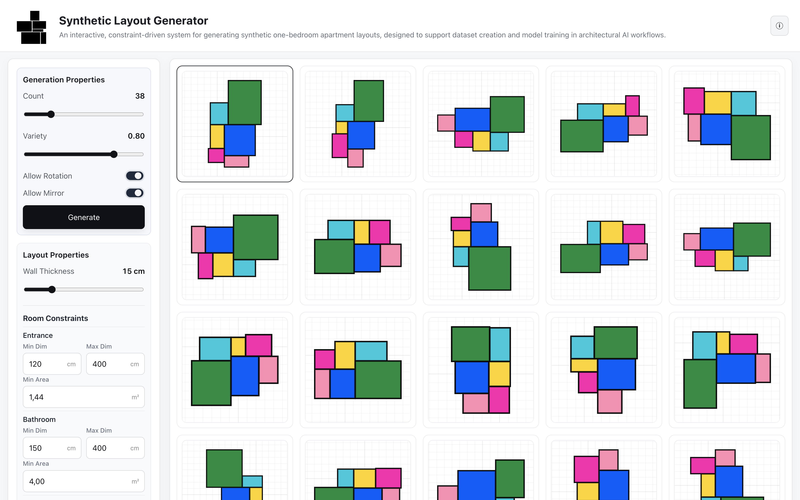
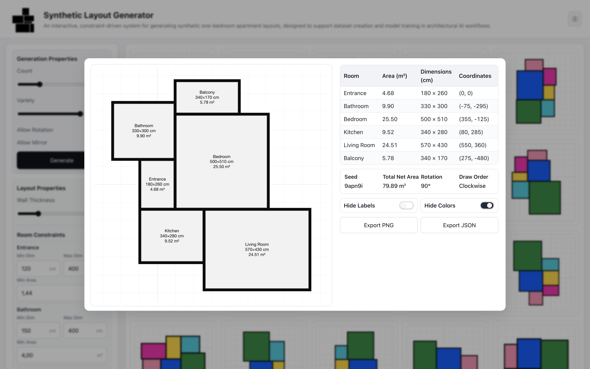

# Synthetic Layout Generator — Web UI

[](https://sadikaksu.github.io/synthetic-layout-ui/)


[](LICENSE.md)

An interactive web interface for exploring **synthetic one-bedroom (1+1) apartment layout generation** through controllable constraints, distributions, and spatial rules.

This project accompanies and extends an academic research effort on using **synthetic data** as a design and training medium for architectural intelligence systems.

---

## Overview

The **Synthetic Layout Generator UI** allows users to interactively generate and inspect **one-bedroom apartment (1+1) layouts** produced by a rule-based synthetic generator.

Rather than producing a single “optimal” plan, the system focuses on:

- **Variation**
- **Constraint logic**
- **Adjacency rules**
- **Cultural and regulatory assumptions embedded in layouts**

The UI acts as a bridge between **research logic** and **spatial intuition**.

> This is not a production floor-plan generator.  
> It is an exploratory, analytical, and educational tool.

---

## Background & Research Context

This interface is derived from the master’s thesis:

**“Training GANs with Synthetic Data: A Dual-Layered Approach to AI-Driven Architectural Layout Generation”**  
Mehmet Sadık Aksu, 2025

The core research investigates:

- How architectural layouts can be **synthetically generated** using rule-based systems
- How such datasets can be used to **train generative models**
- How spatial, cultural, and regulatory biases appear in generated data

To maintain a focused and controlled scope, the research — and this UI — specifically targets  
**one-bedroom apartment units (1+1 flats)** as a foundational residential typology.

The UI was developed to:

- Externalize the generator’s assumptions
- Make synthetic data generation inspectable and adjustable
- Support research communication and experimentation

📄 Related blog post:  
https://sadikaksu.com/blog/synthetic-layout-generator

---

## Why a Web UI?

Architectural generators are often hidden behind code and parameters.

This UI was built to:

- Make **design logic visible**
- Allow **non-programmers** to explore generative systems
- Enable rapid testing of parameter ranges
- Serve as a **research demonstrator** rather than a black box

---

## Capabilities

- Generate synthetic **one-bedroom apartment (1+1) layouts** in real time
- Control global parameters such as:
  - Unit size ranges
  - Room distributions
  - Adjacency constraints
- Visualize layouts as simplified architectural diagrams
- Export and inspect generated results
- Observe how small parameter changes affect spatial outcomes

---

## How to Use the UI

1. Open the live demo  
   👉 **https://sadikaksu.github.io/synthetic-layout-ui/**

2. Adjust parameters using the control panel

3. Regenerate layouts to explore variation

4. Observe recurring spatial patterns and anomalies within the **one-bedroom unit typology**

---

## Example Outputs





---

## Project Structure

```text
synthetic-layout-ui/
├── index.html
├── src/
│   ├── generator/
│   ├── ui/
│   └── utils/
├── docs/
│   └── images/
├── LICENSE.md
└── README.md
```

---

## License

This project is licensed under **Creative Commons Attribution–NonCommercial (CC BY-NC 4.0)**.

You are free to:

- Share and adapt the work
- Use it for research, education, and non-commercial purposes

Under the following conditions:

- **Attribution is required**
- **Commercial use is not permitted**

See `LICENSE.md` for details.

---

## Citation

If you use this project in academic or research work, please cite:

> Aksu, M. S. (2025).
> _Training GANs with Synthetic Data: A Dual-Layered Approach to AI-Driven Architectural Layout Generation._

---

## Acknowledgements

Developed as part of ongoing research at the intersection of:

- Architecture
- Generative systems
- Artificial intelligence
- Synthetic data methodologies
